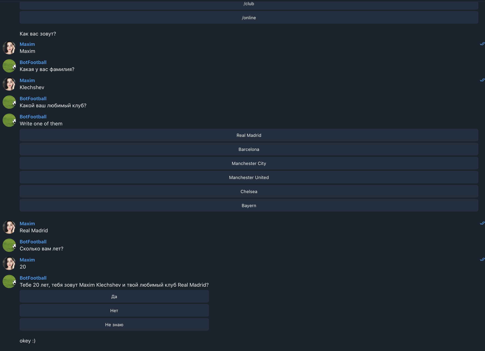
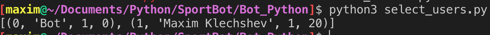

# Football Telegram Bot
- Бот написан для получения данных о футбольных предпочтениях. Также бот дает актуальную информацию о вашем любимым футбольным клубе.

- Бот написан с использованием proxy от Tor Browser, написан на чистом Python3 и в качестве СУБД использует PostgreSQL. Сам бот в телеграме: @awesome_sport_bot.
- Процесс использвования в телеграме:
- Запуск бота `python3 bot.py`
- Создание БД `python3 db_create.py`
- Собирать данные `python3 select_users.py`
  Пример: 

